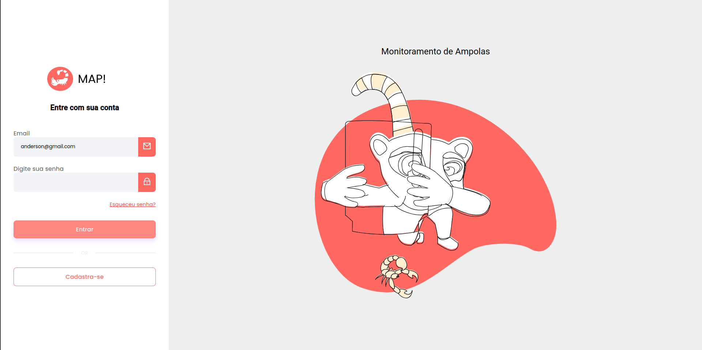

[TYPESCRIPT__BADGE]: https://img.shields.io/badge/TypeScript-3178C6?logo=typescript&logoColor=fff&style=for-the-badge
[ANGULAR__BADGE]: https://img.shields.io/badge/Angular-red?style=for-the-badge&logo=angular
[JAVA_BADGE]: https://img.shields.io/badge/Java-ED8B00?style=for-the-badge&logo=openjdk&logoColor=white
[SPRINGBOOT_BADGE]: https://img.shields.io/badge/Spring%20Boot-6DB33F?logo=springboot&logoColor=fff&style=for-the-badge
[SAAS_BADGE]: https://img.shields.io/badge/Sass-CC6699?style=for-the-badge&logo=sass&logoColor=white

<h1 align="center" style="font-weight: bold;">Página de login e cadastro em Angular 💻</h1>

![angular][ANGULAR__BADGE]
![typescript][TYPESCRIPT__BADGE]
![jAva][JAVA_BADGE]
![spring][SPRINGBOOT_BADGE]
![saas][SAAS_BADGE]

 <a href="#about">Sobre</a> • 
 <a href="#started">Começando</a> • 
  <a href="#started">App Routes</a> • 

    

<h2 id="started">📌 Sobre</h2>

Este projeto é um aplicativo de Login e Cadastro de usuários, e também cadastro de ampolas para animais peçonhentos. Desensolvido para dar suporte no monitoramente de ampolas e os postos terem suporte de suas fronteiras municipais macro sem se desloccar para muito longe e assim salvar vidas. O projeto é em Angular com autenticação e integração com backend.

<h2 id="started">🚀 Começando</h2>

<h3>Pré-requisitos</h3>

Aqui estão alguns pré-requisitos utilizados neste projeto. Por exemplo:

- [NodeJS](https://github.com/)
- [Git 2](https://github.com)
- [Angular CLI](https://angular.io/cli)

<h2 id="routes">📍 Rotas de aplicação</h2>

​
| Rota               | descrição                                          
|----------------------|-----------------------------------------------------
| <kbd>/signup</kbd>     | Pagina Para se cadastrar
| <kbd>/login</kbd>     | Pagina para login
| <kbd>/user</kbd>     | Página protegida que somente usuários logados podem acessar
